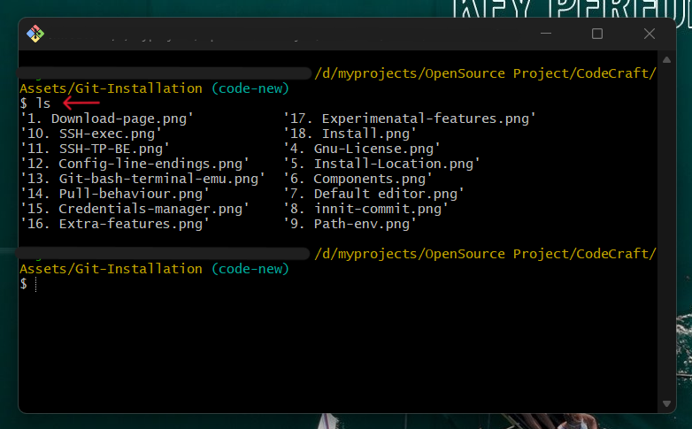

# Learning Path: Git and GitHub Mastery

In this guide, we will embark on a journey to enhance your development skills by first diving into the fundamental concepts of Git, denoted by the section titled "Git Fundamentals" (🚀 Learning Git First). Git is the cornerstone of version control, enabling you to manage your code efficiently, track changes, and collaborate seamlessly.

Following our exploration of Git, we will transition to the realm of GitHub, represented by the section titled "GitHub Essentials" (✨ GitHub Comes Next). GitHub serves as a collaborative platform that extends Git's capabilities, allowing you to host your projects, collaborate with a global community, and utilize powerful features like issue tracking and pull requests.

### Why 🚀 & When 📅 We Need Git In Real Life Situation? (Bob 🧔🏽 & John 👨🏽‍🦲Version)

To understand Git 🤔, then we need to understand it's scenario and why we need to use them, Everyone knows that ✨ Git is a Version Control System but they don't know what are actual reasons why (including "_**when**_") we need to use Git in real life situation 🥲?

Before we taking any further steps, make sure revisiting a subject or section isn't a crime. Sometimes you have to come back to the section to clarify things that won't get understandable at first glance.

So we brought you up with a (🧔🏽) _**Bob &**_ (👨🏽‍🦲) _**John "GIT" Version**_.
 
 

![Remember](https://img.shields.io/badge/Remember-45FFCA.svg?logo=data:image/svg+xml;base64,PHN2ZyByb2xlPSJpbWciIHZpZXdCb3g9IjAgMCAyNCAyNCIgeG1sbnM9Imh0dHA6Ly93d3cudzMub3JnLzIwMDAvc3ZnIj48dGl0bGU+Um9ib3QgRnJhbWV3b3JrPC90aXRsZT48cGF0aCBkPSJNNC45NTY1IDEwLjIyNDZjMC0xLjg3NjYgMS41MjU3LTMuNDAyMyAzLjQtMy40MDIzIDEuODc2NiAwIDMuNDAyNCAxLjUyNTcgMy40MDI0IDMuNDAyMyAwIC42ODM4LS41NTI2IDEuMjM2NC0xLjIzNDEgMS4yMzY0LS42ODE4IDAtMS4yMzQ0LS41NTI2LTEuMjM0NC0xLjIzNjQgMC0uNTEzLS40MTg1LS45Mjk2LS45MzM4LS45Mjk2LS41MTI5IDAtLjkzMTcuNDE2NS0uOTMxNy45Mjk2IDAgLjY4MzgtLjU1MjMgMS4yMzY0LTEuMjM0IDEuMjM2NC0uNjgxOCAwLTEuMjM0NC0uNTUyNi0xLjIzNDQtMS4yMzY0bTE0LjA4NjggNS43MTdjMCAuNjg0Mi0uNTUyNCAxLjIzNjMtMS4yMzQxIDEuMjM2M0g2LjM1NzVjLS42ODE4IDAtMS4yMzQ0LS41NTItMS4yMzQ0LTEuMjM2MyAwLS42ODM3LjU1MjYtMS4yMzYzIDEuMjM0NC0xLjIzNjNoMTEuNDUxN2MuNjgxNyAwIDEuMjM0LjU1MjYgMS4yMzQgMS4yMzYzbS01LjM1MS01LjAyNDRjLS4zODE0LS41NjU3LS4yMzIzLTEuMzMyOC4zMzM0LTEuNzE0M2wyLjg2MjgtMS45MzM0Yy41NjEzLS4zOTAyIDEuMzMyOS0uMjMyNCAxLjcxNDQuMzI4OS4zODE1LjU2NTQuMjMyMyAxLjMzMjktLjMzMzQgMS43MTQ0bC0yLjg2MjggMS45MzMzYy0uNTQ0Mi4zODMxLTEuMzM0OC4yMzc5LTEuNzE0NC0uMzI4OXptNy44MzkzIDcuNjAxOGEuODgxNS44ODE1IDAgMCAxLS4yNTguNjIyN2wtMi4xMjc3IDIuMTI3N2EuODgyMi44ODIyIDAgMCAxLS42MjMuMjU4SDUuNDc3MmEuODgyMi44ODIyIDAgMCAxLS42MjMtLjI1OGwtMi4xMjc3LTIuMTI3N2EuODgxNS44ODE1IDAgMCAxLS4yNTgtLjYyMjdWNS40ODE4YS44Nzk3Ljg3OTcgMCAwIDEgLjI1OC0uNjIyOGwyLjEyNzctMi4xMjgyYS44ODE2Ljg4MTYgMCAwIDEgLjYyMy0uMjU3OGgxMy4wNDU2YS44ODE2Ljg4MTYgMCAwIDEgLjYyMy4yNTc4bDIuMTI3NyAyLjEyODJhLjg3OTcuODc5NyAwIDAgMSAuMjU4LjYyMjhWMTguNTE5em0xLjgxMS0xNS4wODM1TDIwLjU2NDQuNjU3N0EyLjI0NTQgMi4yNDU0IDAgMCAwIDE4Ljk3NzUgMEg1LjAyMDdBMi4yNDQ1IDIuMjQ0NSAwIDAgMCAzLjQzMy42NThMLjY1NyAzLjQzNTlBMi4yNDQ5IDIuMjQ0OSAwIDAgMCAwIDUuMDIyOHYxMy45NTQ3YzAgLjU5NTMuMjM2NiAxLjE2NjcuNjU3NSAxLjU4NzJsMi43NzggMi43Nzc5Yy40MjEuNDIxLjk5MTguNjU3MyAxLjU4NzEuNjU3M2gxMy45NTQ4YTIuMjQ0OCAyLjI0NDggMCAwIDAgMS41ODcyLS42NTczbDIuNzc3OS0yLjc3NzlBMi4yNDM2IDIuMjQzNiAwIDAgMCAyNCAxOC45Nzc1VjUuMDIzYTIuMjQ1MSAyLjI0NTEgMCAwIDAtLjY1NzUtMS41ODc1eiIvPjwvc3ZnPg==)

**_All the Git terms may sound like scaring you at first time, But don't worry we will teach you everything with perfect example to grasp the concept less than in few-less attempts._**
 
 
 

| **Step**    🚀                  | **Description**    🏝️                                                                                  |
| -------------------------- | ------------------------------------------------------------------------------------------------ |
| Starting the Project       | 🧔🏽**Bob** and 👨🏽‍🦲**John** decide to collaborate on a new web application. They create a shared Git repository for the project on a platform like GitHub. |
| Initial Commit             | 🧔🏽**Bob** starts by writing the initial code for the project and makes his first commit to the repository, marking it as "Initial Commit." |
| Branching                  | 👨🏽‍🦲**John** wants to work on a new feature separately without affecting the main project. He creates a new branch called "FeatureX" using Git. This branch is like a separate workspace. |
| Working Independently      | 🧔🏽**Bob** continues to work on the main project in the "master" branch, while 👨🏽‍🦲**John** makes changes and additions to the "FeatureX" branch. |
| Committing Changes         | Both 🧔🏽**Bob** and 👨🏽‍🦲**John** regularly commit their changes to Git. They add meaningful commit messages to describe what they've done, making it easier to understand the history of the project. |
| Pulling Changes            | Periodically, they pull each other's changes from the remote repository to stay up-to-date with the latest code. This ensures they are both working with the most current version. |
| Resolving Conflicts        | There may be times when 🧔🏽**Bob** and 👨🏽‍🦲**John** make changes to the same part of the code. In such cases, Git helps them identify and resolve conflicts, ensuring their work fits together smoothly. |
| Testing and Review         | They can easily switch between branches to test different features. They also use Git's pull request feature to review and discuss each other's code changes. |
| Merging Changes            | Once they are satisfied with their work, they merge the "FeatureX" branch back into the "master" branch. This brings John's new feature into the main project. |
| Project Progress           | 🧔🏽**Bob** and 👨🏽‍🦲**John** continue this collaborative process, creating new branches for other features or bug fixes as needed. Git keeps a clear history of who did what and when. |
| Backup and Recovery        | Git serves as a backup for their project. If anything goes wrong, they can always revert to a previous commit to recover their work. |

### 📚 Table of Contents

| Section            | Description               |
|--------------------|---------------------------|
| [1. Git Fundamentals](#git-fundamentals) | 🚀 Learning Git First |
| [2. GitHub Essentials]() | ✨ GitHub Comes Next |

## Git Fundamentals

In the ever-evolving world of software development, version control is an indispensable tool. Git, the focus of our initial exploration, stands as the bedrock of version control systems, enabling developers to efficiently manage their code, keep track of changes, and collaborate seamlessly.

In simple terms, Git is like a super helpful tool that makes it easy for people to work on computer programs together and keep track of changes they make. It's like a solid foundation for managing code.

### Why Git Matters

---

Git's significance cannot be overstated. It empowers individuals and teams to work on projects of any scale with confidence. Whether you're a solo developer working on a personal project or part of a large team collaborating on a complex software solution, Git provides the framework for structured, organized, and error-resistant code development.

(We are using Git to push our files to this repository for context)

## What You'll Learn

Throughout the "Git Fundamentals" section, you'll embark on a journey to master the essential concepts and workflows of Git. We'll cover topics such as:

1. **[Git Installation](#git-installation)**
2. **[Git Basics](#git-basics)**
3. **[Git Commands](#git-commands)**
4. **[Git Branching](#git-branching)**
5. **[Working with Git](#working-with-git)**
6. **[Collaboration](#collaboration)**
7. **[Branching Strategies](#branching-strategies)**
8. **[Git History](#git-history)**
9. **[Stashing](#stashing)**
10. **[Reset and Revert](#reset-and-revert)**
11. **[Interactive Rebase](#interactive-rebase)**
12. **[Gitignore](#gitignore)**
13. **[Tags](#tags)**
14. **[Remote Repositories](#remote-repositories)**
15. **[Forks and Pull Requests (GitHub-specific)](#forks-and-pull-requests)**
16. **[Setting Up Git with GitHub](#setting-up-git-with-github)**
17. **[Git Best Practices](#git-best-practices)**
18. **[Troubleshooting](#troubleshooting)**
19. **[Git GUI Tools](#git-gui-tools)**

By the end of this section, you'll have a solid foundation in Git, setting the stage for you to become a proficient version control practitioner.

# Git Installation

This tutorial assumes that you are using a Windows operating system and want to start using Git. If you're using Linux or macOS, you can refer to the official Git documentation for installation instructions provided by the creators themselves [here](https://git-scm.com/book/en/v2/Getting-Started-Installing-Git).

## Choosing the Right Edition

Before we begin, it's essential to understand the two available options for Git installation on Windows:

### Standalone Installer

- Think of it as a standard software installation on your computer, similar to installing any other program.
- When you use the standalone installer, Git becomes a part of your computer's standard toolset.
- You can use Git from anywhere on your computer without any additional steps.
- It's an excellent choice if you plan to use Git regularly and want it to seamlessly integrate with other software on your computer.

### Portable ("Thumbdrive Edition")

- Imagine it as a portable tool that you can carry around on a USB drive, like a digital Swiss Army knife.
- It doesn't install Git on your computer; instead, it runs directly from the USB drive.
- You can use Git on different computers without leaving any traces on those computers.
- It's convenient when you need to use Git on multiple computers without making any changes to those computers, such as when you're on the go or using a friend's computer.

For this tutorial, we will install the standalone installer and explain how to install it on your Windows computer. Please follow the step-by-step guide below to install Git correctly.

## Git Installation Steps

1. Visit the official Git download page for Windows at [https://git-scm.com/download/win](https://git-scm.com/download/win).

2. Download the **Standalone Installer** (64-bit or 32-bit) based on your computer's architecture.

   If you are unsure about your Windows bit version, please follow this tutorial to check your computer's bit version: [How to Check Windows Bit Rate](https://support.microsoft.com/en-us/windows/32-bit-and-64-bit-windows-frequently-asked-questions-c6ca9541-8dce-4d48-0415-94a3faa2e13d).

    

3. Once the download is complete, double-click on the installer file to run the setup wizard.

4. The setup wizard will start, and you'll be presented with the GNU license agreement. Read through it and click "Next."

    

5. Choose the location to install Git. It is recommended to leave it as the default (usually on the C drive), but you can choose another location if needed. Click "Next."

    

6. You'll be asked to choose components. You can leave these settings as default, but if you want a desktop icon for Git, check the "**Additional icons**" option. Uncheck "**Check daily for Git updates**" if you prefer not to receive daily update checks. Click "Next."

    _Adding Git Bash to Windows Terminal" means choosing whether or not you want to have a special tool called Git Bash available in the Windows Terminal._

    

7. On the next screen, you'll be prompted to choose a default text editor for Git. Choose "Use Visual Studio as Git's default editor". Click "Next."

    

8.  Leave everything as default on the following screen and click "**Let Git decide**." Then click "Next."
   
    

9.  Adjust the path environment by checking the recommended options: "**Git from the command line and Git from 3rd-party software**." Click "Next."

    _When you select this option, it makes sure that Git can be used with different text-based tools like Command Prompt, PowerShell, and others. This helps you manage and keep track of different versions of your work and makes it easier to organize your projects._
   
    

10. Choose the **bundled OpenSSH** option for the SSH executable and click "Next."

    _Choosing "bundled OpenSSH" is like giving your computer a secure way to talk to other computers on the internet. This can be useful when you want to securely connect to faraway computers or share files online, even if you're not a technical expert. Think of it as having a special key to open a secure internet door._
   
    

11. For the HTTPS transport (SSL/TLS library), select "**Use the OpenSSL library**" and click "Next."

    _By selecting "**Use the OpenSSL library**," it's like adding an extra layer of security to your internet activities. This helps protect your online communication, like when you visit secure websites or download files. It's similar to picking a strong lock to keep your online interactions safe._
   
    

12. On the "Configuring the line ending conversion" screen, leave it as the default by checking the first option, "**Checkout Windows-style, commit Unix-style line endings.**" Click "Next."

    _This option ensures that text files look and work correctly on your computer, whether you're using Windows or another system. It's like making sure your documents are easy to read and share, no matter where you are._
   
    

13. To configure the terminal emulator to use with Git Bash, click on the 1st option "**Use minTTY (the default terminal of MSYS2)**." If you prefer a different terminal, you can choose the 2nd option, but it's not recommended for a seamless experience.
   
    

14. For Git pull, leave it as the default option "**Default (fast-forward or merge)**" and click "Next."
   
    

15. On the next screen, **Credentials helper**, leave everything as default "**Git credentials manager**" and click "Next."
   
    

16. On the "Configuring extra options" screen, check the "**Enable file system caching**" checkbox and click "Next."
   
    

17. On the "Configuring experimental options" screen, **leave both options unchecked**.
   
    

18. Click "**INSTALL**" to begin the installation process.
   
    

19. Once the installation is complete, uncheck "View release notes" and check "**Launch Git Bash**" to run the Git command-line interface.

20. In the Git Bash command line, type `ls` to list files in the directory you're in. This will confirm that Git is installed and working correctly.
   
    

## If you prefer a visual guide on installing Git, then check out the following YouTube links:

### On Linux:

### On Windows: 

### On Mac: 

Now that you have Git installed on your Windows machine, you can proceed to learn the basics of Git and how to use it for version control and collaboration.