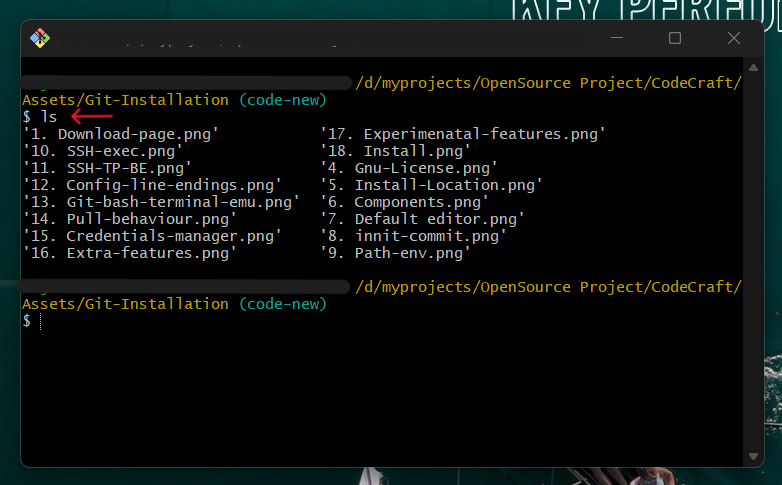

# Git and GitHub Mastery

In this guide, we will embark on a journey to enhance your development skills by first diving into the fundamental concepts of Git, denoted by the section titled "Git Fundamentals" (🚀 Learning Git First). Git is the cornerstone of version control, enabling you to manage your code efficiently, track changes, and collaborate seamlessly.

- Check here 🚀 [**Git Explained in 100 Seconds by FireShip**](https://www.youtube.com/watch?v=hwP7WQkmECE&pp=ygUQR2l0IGNyYXNoIGNvdXJzZQ==)

✨ Kindly check the above video that explains Git in 100 seconds to grasp the content below, which is accerelate your understanding.

Following our exploration of Git, we will transition to the realm of GitHub, represented by the section titled "GitHub Essentials" (✨ GitHub Comes Next). GitHub serves as a collaborative platform that extends Git's capabilities, allowing you to host your projects, collaborate with a global community, and utilize powerful features like issue tracking and pull requests.

# Git Fundamentals

In the ever-evolving world of software development, version control is an indispensable tool. Git, the focus of our initial exploration, stands as the bedrock of version control systems, enabling developers to efficiently manage their code, keep track of changes, and collaborate seamlessly.

In simple terms, Git is like a super helpful tool that makes it easy for people to work on computer programs together and keep track of changes they make. It's like a solid foundation for managing code.

### Why Git Matters

---

Git's significance cannot be overstated. It empowers individuals and teams to work on projects of any scale with confidence. Whether you're a solo developer working on a personal project or part of a large team collaborating on a complex software solution, Git provides the framework for structured, organized, and error-resistant code development.

(We are using Git to push our files to this repository for context)

## What You'll Learn

Throughout the "Git Fundamentals" section, you'll embark on a journey to master the essential concepts and workflows of Git. We'll cover topics such as:

1. **[Git Installation](#git-installation)**
2. **[What is Git?](#what-is-git)**
3. **[How To Work With Git?](#how-to-work-with-git)**
4. **[Setup Git](#setup-git)**
5. **[Creating a Repository](#creating-a-repository)**
6. **[Making Changes](#making-changes)**
7. **[Viewing History](#viewing-history)**
8. **[Collaboration](#collaboration)**
9. **[Branching](#branching)**
10. **[Undoing Changes](#reset-and-revert)**
11. **[Git In Real Life Example](#git-in-real-life-situation)**
12. **[.gitignore](#understanding-gitignore-for-beginners)**
<!-- 13. **[Tags](#tags)**
14. **[Git Best Practices](#git-best-practices)**
15. **[Troubleshooting](#troubleshooting)**
16. **[Git GUI Tools](#git-gui-tools)** -->

By the end of this section, you'll have a solid foundation in Git, setting the stage for you to become a proficient version control practitioner.

# Git Installation

This tutorial assumes that you are using a Windows operating system and want to start using Git. If you're using Linux or macOS, you can refer to the official Git documentation for installation instructions provided by the creators themselves [here](https://git-scm.com/book/en/v2/Getting-Started-Installing-Git).

## Choosing the Right Edition

Before we begin, it's essential to understand the two available options for Git installation on Windows:

### Standalone Installer

- Think of it as a standard software installation on your computer, similar to installing any other program.
- When you use the standalone installer, Git becomes a part of your computer's standard toolset.
- You can use Git from anywhere on your computer without any additional steps.
- It's an excellent choice if you plan to use Git regularly and want it to seamlessly integrate with other software on your computer.

### Portable ("Thumbdrive Edition")

- Imagine it as a portable tool that you can carry around on a USB drive, like a digital Swiss Army knife.
- It doesn't install Git on your computer; instead, it runs directly from the USB drive.
- You can use Git on different computers without leaving any traces on those computers.
- It's convenient when you need to use Git on multiple computers without making any changes to those computers, such as when you're on the go or using a friend's computer.

For this tutorial, we will install the standalone installer and explain how to install it on your Windows computer. Please follow the step-by-step guide below to install Git correctly.

## Git Installation Steps

1. Visit the official Git download page for Windows at [https://git-scm.com/download/win](https://git-scm.com/download/win).

2. Download the **Standalone Installer** (64-bit or 32-bit) based on your computer's architecture.

   If you are unsure about your Windows bit version, please follow this tutorial to check your computer's bit version: [How to Check Windows Bit Rate](https://support.microsoft.com/en-us/windows/32-bit-and-64-bit-windows-frequently-asked-questions-c6ca9541-8dce-4d48-0415-94a3faa2e13d).

    

3. Once the download is complete, double-click on the installer file to run the setup wizard.

4. The setup wizard will start, and you'll be presented with the GNU license agreement. Read through it and click "Next."

    

5. Choose the location to install Git. It is recommended to leave it as the default (usually on the C drive), but you can choose another location if needed. Click "Next."

    

6. You'll be asked to choose components. You can leave these settings as default, but if you want a desktop icon for Git, check the "**Additional icons**" option. Uncheck "**Check daily for Git updates**" if you prefer not to receive daily update checks. Click "Next."

    _Adding Git Bash to Windows Terminal" means choosing whether or not you want to have a special tool called Git Bash available in the Windows Terminal._

    

7. On the next screen, you'll be prompted to choose a default text editor for Git. Choose "Use Visual Studio as Git's default editor". Click "Next."

    

8. Leave everything as default on the following screen and click "**Let Git decide**." Then click "Next."

    

9. Adjust the path environment by checking the recommended options: "**Git from the command line and Git from 3rd-party software**." Click "Next."

    _When you select this option, it makes sure that Git can be used with different text-based tools like Command Prompt, PowerShell, and others. This helps you manage and keep track of different versions of your work and makes it easier to organize your projects._

    

10. Choose the **bundled OpenSSH** option for the SSH executable and click "Next."

    _Choosing "bundled OpenSSH" is like giving your computer a secure way to talk to other computers on the internet. This can be useful when you want to securely connect to faraway computers or share files online, even if you're not a technical expert. Think of it as having a special key to open a secure internet door._

    

11. For the HTTPS transport (SSL/TLS library), select "**Use the OpenSSL library**" and click "Next."

    _By selecting "**Use the OpenSSL library**," it's like adding an extra layer of security to your internet activities. This helps protect your online communication, like when you visit secure websites or download files. It's similar to picking a strong lock to keep your online interactions safe._

    

12. On the "Configuring the line ending conversion" screen, leave it as the default by checking the first option, "**Checkout Windows-style, commit Unix-style line endings.**" Click "Next."

    _This option ensures that text files look and work correctly on your computer, whether you're using Windows or another system. It's like making sure your documents are easy to read and share, no matter where you are._

    

13. To configure the terminal emulator to use with Git Bash, click on the 1st option "**Use minTTY (the default terminal of MSYS2)**." If you prefer a different terminal, you can choose the 2nd option, but it's not recommended for a seamless experience.

    

14. For Git pull, leave it as the default option "**Default (fast-forward or merge)**" and click "Next."

    

15. On the next screen, **Credentials helper**, leave everything as default "**Git credentials manager**" and click "Next."

    

16. On the "Configuring extra options" screen, check the "**Enable file system caching**" checkbox and click "Next."

    

17. On the "Configuring experimental options" screen, **leave both options unchecked**.

    

18. Click "**INSTALL**" to begin the installation process.

    

19. Once the installation is complete, uncheck "View release notes" and check "**Launch Git Bash**" to run the Git command-line interface.

20. In the Git Bash command line, type `ls` to list files in the directory you're in. This will confirm that Git is installed and working correctly.

    

## If you prefer a visual guide on installing Git, then check out the following YouTube links

### On Linux

- [How to easily install Git on Linux - a video by **LinuxH20**](https://youtu.be/PLQQ3tJwBJg?feature=shared)

### On Windows

- [How to install Git on Windows 10 - a video by **Open Box Tech**](https://youtu.be/-Bfx-v5mIDo?feature=shared)

### On Mac

- [How to install Git on MacOS - a video by **TechRepublic**](https://youtu.be/Mf3l8z6oxQ0?feature=shared)

Now that you have Git installed on your Windows machine, you can proceed to learn the basics of Git and how to use it for version control and collaboration.

# What is Git?

Git is like a magical notebook for your computer. It helps you keep track of all the changes you make to your files or projects. You can go back in time and see what your work looked like at different points. Git is also a fantastic tool for collaborating with others on the same project without causing chaos.

# How to Work With Git?

Working with Git is straightforward, but it may require some practice to master it quickly. Assuming you've already installed Git and completed the installation process as discussed above, the next step is to set it up with the proper credentials.

Please refer to the following instructions for setting up Git. Make sure to follow these steps carefully to gain a solid understanding of the basics of Git.

## Setting Up Git

To ensure smooth functioning of Git, it's crucial to provide Git with your identity, allowing it to establish a connection between your local Git configuration and your GitHub account (where your code resides).

Think of it like a system that needs to know who you are. Your local Git setup is your personal ID card, and your GitHub account is where all your work is saved online.

When you work with a team, it's like a group project. Knowing who did what is important, just like giving credit for your contributions. It's similar to signing your name on school assignments so everyone knows who did the work. Git helps with this by connecting your ID card (local Git) to your online workspace (GitHub), making it clear who's doing what in the team's projects.

This step is crucial because it's like introducing yourself to the system and letting it keep track of your work, especially when you're collaborating with others. It's akin to showing your ID card in a group project to ensure everyone knows who's responsible for what.

### Step 1: Open Your Git Bash Terminal

Begin by opening the Git Bash terminal. You can do this by right-clicking on your desktop or any folder and selecting "Git Bash Here."

### Step 2: Provide Your Information

In the Git terminal, Copy and Paste the following Bash Commands:

1. `git config --global user.name "Your Name"`

   - Replace **"Your Name"** with your actual name or a nickname you prefer inside the double quotation marks.
      
2. `git config --global user.email "youremail@example.com"`
   - Replace "**youremail@example . com**" with your valid email address. (We reccomend you use the email address that was used to create your github account)
      

Completing this setup will ensure that Git recognizes you, simplifying your ability to collaborate on projects and effectively manage your work.

## Creating a Repository

Create a Git Repository: A Git Repository is like a folder where Git keeps track of your project. If you've an existing project, go to that project's folder using the terminal and run this command `git init`.

Question: What if I don't have a existing project and wanted to create a fresh project?

It's simple and easy. Create a folder with your project name `eg: My New Git Project` and navigate to folder using Command Prompt or Terminal, then use this command `git init` to initilaize the Git.

## Creating a Git Repository

A Git Repository is like a folder where Git keeps track of your project. To create a new Git repository, you can use the following steps:

1. Create a new directory (folder) for your project.

    `mkdir "Your Folder Name"`

2. Navigate to the directory in your terminal.

    `cd "Your Folder Name"`

3. Run the command.

   `git init`

The **git init** command is like giving your project a superpower – it turns your project folder into a smart one that can remember all its changes and versions.

Imagine your project as a folder of important papers. When you run `git init`, it magically adds a special control room called `.git` inside that folder. This control room keeps a detailed record of everything that happens to your project.

![Remember](https://img.shields.io/badge/Remember-45FFCA.svg?logo=data:image/svg+xml;base64,PHN2ZyByb2xlPSJpbWciIHZpZXdCb3g9IjAgMCAyNCAyNCIgeG1sbnM9Imh0dHA6Ly93d3cudzMub3JnLzIwMDAvc3ZnIj48dGl0bGU+Um9ib3QgRnJhbWV3b3JrPC90aXRsZT48cGF0aCBkPSJNNC45NTY1IDEwLjIyNDZjMC0xLjg3NjYgMS41MjU3LTMuNDAyMyAzLjQtMy40MDIzIDEuODc2NiAwIDMuNDAyNCAxLjUyNTcgMy40MDI0IDMuNDAyMyAwIC42ODM4LS41NTI2IDEuMjM2NC0xLjIzNDEgMS4yMzY0LS42ODE4IDAtMS4yMzQ0LS41NTI2LTEuMjM0NC0xLjIzNjQgMC0uNTEzLS40MTg1LS45Mjk2LS45MzM4LS45Mjk2LS41MTI5IDAtLjkzMTcuNDE2NS0uOTMxNy45Mjk2IDAgLjY4MzgtLjU1MjMgMS4yMzY0LTEuMjM0IDEuMjM2NC0uNjgxOCAwLTEuMjM0NC0uNTUyNi0xLjIzNDQtMS4yMzY0bTE0LjA4NjggNS43MTdjMCAuNjg0Mi0uNTUyNCAxLjIzNjMtMS4yMzQxIDEuMjM2M0g2LjM1NzVjLS42ODE4IDAtMS4yMzQ0LS41NTItMS4yMzQ0LTEuMjM2MyAwLS42ODM3LjU1MjYtMS4yMzYzIDEuMjM0NC0xLjIzNjNoMTEuNDUxN2MuNjgxNyAwIDEuMjM0LjU1MjYgMS4yMzQgMS4yMzYzbS01LjM1MS01LjAyNDRjLS4zODE0LS41NjU3LS4yMzIzLTEuMzMyOC4zMzM0LTEuNzE0M2wyLjg2MjgtMS45MzM0Yy41NjEzLS4zOTAyIDEuMzMyOS0uMjMyNCAxLjcxNDQuMzI4OS4zODE1LjU2NTQuMjMyMyAxLjMzMjktLjMzMzQgMS43MTQ0bC0yLjg2MjggMS45MzMzYy0uNTQ0Mi4zODMxLTEuMzM0OC4yMzc5LTEuNzE0NC0uMzI4OXptNy44MzkzIDcuNjAxOGEuODgxNS44ODE1IDAgMCAxLS4yNTguNjIyN2wtMi4xMjc3IDIuMTI3N2EuODgyMi44ODIyIDAgMCAxLS42MjMuMjU4SDUuNDc3MmEuODgyMi44ODIyIDAgMCAxLS42MjMtLjI1OGwtMi4xMjc3LTIuMTI3N2EuODgxNS44ODE1IDAgMCAxLS4yNTgtLjYyMjdWNS40ODE4YS44Nzk3Ljg3OTcgMCAwIDEgLjI1OC0uNjIyOGwyLjEyNzctMi4xMjgyYS44ODE2Ljg4MTYgMCAwIDEgLjYyMy0uMjU3OGgxMy4wNDU2YS44ODE2Ljg4MTYgMCAwIDEgLjYyMy4yNTc4bDIuMTI3NyAyLjEyODJhLjg3OTcuODc5NyAwIDAgMSAuMjU4LjYyMjhWMTguNTE5em0xLjgxMS0xNS4wODM1TDIwLjU2NDQuNjU3N0EyLjI0NTQgMi4yNDU0IDAgMCAwIDE4Ljk3NzUgMEg1LjAyMDdBMi4yNDQ1IDIuMjQ0NSAwIDAgMCAzLjQzMy42NThMLjY1NyAzLjQzNTlBMi4yNDQ5IDIuMjQ0OSAwIDAgMCAwIDUuMDIyOHYxMy45NTQ3YzAgLjU5NTMuMjM2NiAxLjE2NjcuNjU3NSAxLjU4NzJsMi43NzggMi43Nzc5Yy40MjEuNDIxLjk5MTguNjU3MyAxLjU4NzEuNjU3M2gxMy45NTQ4YTIuMjQ0OCAyLjI0NDggMCAwIDAgMS41ODcyLS42NTczbDIuNzc3OS0yLjc3NzlBMi4yNDM2IDIuMjQzNiAwIDAgMCAyNCAxOC45Nzc1VjUuMDIzYTIuMjQ1MSAyLjI0NTEgMCAwIDAtLjY1NzUtMS41ODc1eiIvPjwvc3ZnPg==)  
Think of it like a time machine for your work. Every time you make a change or save something new, Git takes a snapshot and stores it in this control room. So, if you ever need to go back in time to see how things looked before, Git has got you covered.

**Question: What if I already have an existing project that I want to add to Git?**

If you already have a project and want to start using Git, it's as easy as running `git init` in your project's folder. This action activates Git's superpower for your existing work, allowing you to keep track of changes, collaborate with others, and explore the history of your project.

<!-- Here are some additional things to keep in mind when creating a Git repository:

        1. **Choose a Good Name**: When you create a Git project, give it a clear and unique name that tells everyone what your project is all about. It's like giving a name to a folder on your computer.

        2. **Add Your Files**: Once you have your Git project, you can start putting your project files in it. Think of this step as placing your documents in a special folder. You use the `git add` command for this.

        3. **Save Your Work**: After adding your files, you need to save your changes. This is similar to saving a document on your computer, but in Git, it's called "committing." You use the `git commit` command to save your work.

        These steps help you keep track of your project, collaborate with others, and make sure your work is organized and secure. -->

## Making Changes

Add files: Add the files you want to track to the repository, It's like putting things in your magic notebook by using this command `git add filename.ext`

Commit Changes: Committing is like saving your work in the magic notebook with a description of what you did by using this command `git commit -m "Describe Your Changes here"`

## Viewing History

You can check what you've done in the past using this command `git log`

## Collaboration

Working with Others: If you're working with others, you can share your magic notebook with them on platforms like GitHub or GitLab. It's like passing your notebook around.

Pulling and Pushing: To get others' changes and share yours, use:

- `git pull` to get the latest changes from the remote repository.

- `git push` to send your changes to the remote repository.

## Branching

Creating Branches: Think of branches as different pages in your magic notebook. You can create a new branch to work on something separate from the main project.

`git branch new-branch-name`

Switching Branches: use this command to switch branches `git checkout branch-name` (to move between branches)

Merging Branches: When you're done with your changes on a branch and want to add them to the main project, you merge the branch by using this command `git merge branch-name`

## Undoing Changes

If you mess up or want to go back in time, Git can help you. Use `git reset` or `git revert` to undo things.

![Remember](https://img.shields.io/badge/Remember-45FFCA.svg?logo=data:image/svg+xml;base64,PHN2ZyByb2xlPSJpbWciIHZpZXdCb3g9IjAgMCAyNCAyNCIgeG1sbnM9Imh0dHA6Ly93d3cudzMub3JnLzIwMDAvc3ZnIj48dGl0bGU+Um9ib3QgRnJhbWV3b3JrPC90aXRsZT48cGF0aCBkPSJNNC45NTY1IDEwLjIyNDZjMC0xLjg3NjYgMS41MjU3LTMuNDAyMyAzLjQtMy40MDIzIDEuODc2NiAwIDMuNDAyNCAxLjUyNTcgMy40MDI0IDMuNDAyMyAwIC42ODM4LS41NTI2IDEuMjM2NC0xLjIzNDEgMS4yMzY0LS42ODE4IDAtMS4yMzQ0LS41NTI2LTEuMjM0NC0xLjIzNjQgMC0uNTEzLS40MTg1LS45Mjk2LS45MzM4LS45Mjk2LS41MTI5IDAtLjkzMTcuNDE2NS0uOTMxNy45Mjk2IDAgLjY4MzgtLjU1MjMgMS4yMzY0LTEuMjM0IDEuMjM2NC0uNjgxOCAwLTEuMjM0NC0uNTUyNi0xLjIzNDQtMS4yMzY0bTE0LjA4NjggNS43MTdjMCAuNjg0Mi0uNTUyNCAxLjIzNjMtMS4yMzQxIDEuMjM2M0g2LjM1NzVjLS42ODE4IDAtMS4yMzQ0LS41NTItMS4yMzQ0LTEuMjM2MyAwLS42ODM3LjU1MjYtMS4yMzYzIDEuMjM0NC0xLjIzNjNoMTEuNDUxN2MuNjgxNyAwIDEuMjM0LjU1MjYgMS4yMzQgMS4yMzYzbS01LjM1MS01LjAyNDRjLS4zODE0LS41NjU3LS4yMzIzLTEuMzMyOC4zMzM0LTEuNzE0M2wyLjg2MjgtMS45MzM0Yy41NjEzLS4zOTAyIDEuMzMyOS0uMjMyNCAxLjcxNDQuMzI4OS4zODE1LjU2NTQuMjMyMyAxLjMzMjktLjMzMzQgMS43MTQ0bC0yLjg2MjggMS45MzMzYy0uNTQ0Mi4zODMxLTEuMzM0OC4yMzc5LTEuNzE0NC0uMzI4OXptNy44MzkzIDcuNjAxOGEuODgxNS44ODE1IDAgMCAxLS4yNTguNjIyN2wtMi4xMjc3IDIuMTI3N2EuODgyMi44ODIyIDAgMCAxLS42MjMuMjU4SDUuNDc3MmEuODgyMi44ODIyIDAgMCAxLS42MjMtLjI1OGwtMi4xMjc3LTIuMTI3N2EuODgxNS44ODE1IDAgMCAxLS4yNTgtLjYyMjdWNS40ODE4YS44Nzk3Ljg3OTcgMCAwIDEgLjI1OC0uNjIyOGwyLjEyNzctMi4xMjgyYS44ODE2Ljg4MTYgMCAwIDEgLjYyMy0uMjU3OGgxMy4wNDU2YS44ODE2Ljg4MTYgMCAwIDEgLjYyMy4yNTc4bDIuMTI3NyAyLjEyODJhLjg3OTcuODc5NyAwIDAgMSAuMjU4LjYyMjhWMTguNTE5em0xLjgxMS0xNS4wODM1TDIwLjU2NDQuNjU3N0EyLjI0NTQgMi4yNDU0IDAgMCAwIDE4Ljk3NzUgMEg1LjAyMDdBMi4yNDQ1IDIuMjQ0NSAwIDAgMCAzLjQzMy42NThMLjY1NyAzLjQzNTlBMi4yNDQ5IDIuMjQ0OSAwIDAgMCAwIDUuMDIyOHYxMy45NTQ3YzAgLjU5NTMuMjM2NiAxLjE2NjcuNjU3NSAxLjU4NzJsMi43NzggMi43Nzc5Yy40MjEuNDIxLjk5MTguNjU3MyAxLjU4NzEuNjU3M2gxMy45NTQ4YTIuMjQ0OCAyLjI0NDggMCAwIDAgMS41ODcyLS42NTczbDIuNzc3OS0yLjc3NzlBMi4yNDM2IDIuMjQzNiAwIDAgMCAyNCAxOC45Nzc1VjUuMDIzYTIuMjQ1MSAyLjI0NTEgMCAwIDAtLjY1NzUtMS41ODc1eiIvPjwvc3ZnPg==)  
**Learning Git takes practice. It's okay to make mistakes because Git helps you recover. Encourage beginners to start with small projects and gradually work their way up to more complex ones.**

## Git In Real Life Situation

### Why 🚀 & When 📅 We Need Git In Real Life Situation? (Bob 🧔🏽 & John 👨🏽‍🦲Version)

To understand Git 🤔, then we need to understand it's scenario and why we need to use them, Everyone knows that ✨ Git is a Version Control System but they don't know what are actual reasons why (including "_**when**_") we need to use Git in real life situation 🥲?

Before we taking any further steps, make sure revisiting a subject or section isn't a crime. Sometimes you have to come back to the section to clarify things that won't get understandable at first glance.

So we brought you up with a (🧔🏽) _**Bob &**_ (👨🏽‍🦲) _**John "GIT" Version**_.
 
 

![Remember](https://img.shields.io/badge/Remember-45FFCA.svg?logo=data:image/svg+xml;base64,PHN2ZyByb2xlPSJpbWciIHZpZXdCb3g9IjAgMCAyNCAyNCIgeG1sbnM9Imh0dHA6Ly93d3cudzMub3JnLzIwMDAvc3ZnIj48dGl0bGU+Um9ib3QgRnJhbWV3b3JrPC90aXRsZT48cGF0aCBkPSJNNC45NTY1IDEwLjIyNDZjMC0xLjg3NjYgMS41MjU3LTMuNDAyMyAzLjQtMy40MDIzIDEuODc2NiAwIDMuNDAyNCAxLjUyNTcgMy40MDI0IDMuNDAyMyAwIC42ODM4LS41NTI2IDEuMjM2NC0xLjIzNDEgMS4yMzY0LS42ODE4IDAtMS4yMzQ0LS41NTI2LTEuMjM0NC0xLjIzNjQgMC0uNTEzLS40MTg1LS45Mjk2LS45MzM4LS45Mjk2LS41MTI5IDAtLjkzMTcuNDE2NS0uOTMxNy45Mjk2IDAgLjY4MzgtLjU1MjMgMS4yMzY0LTEuMjM0IDEuMjM2NC0uNjgxOCAwLTEuMjM0NC0uNTUyNi0xLjIzNDQtMS4yMzY0bTE0LjA4NjggNS43MTdjMCAuNjg0Mi0uNTUyNCAxLjIzNjMtMS4yMzQxIDEuMjM2M0g2LjM1NzVjLS42ODE4IDAtMS4yMzQ0LS41NTItMS4yMzQ0LTEuMjM2MyAwLS42ODM3LjU1MjYtMS4yMzYzIDEuMjM0NC0xLjIzNjNoMTEuNDUxN2MuNjgxNyAwIDEuMjM0LjU1MjYgMS4yMzQgMS4yMzYzbS01LjM1MS01LjAyNDRjLS4zODE0LS41NjU3LS4yMzIzLTEuMzMyOC4zMzM0LTEuNzE0M2wyLjg2MjgtMS45MzM0Yy41NjEzLS4zOTAyIDEuMzMyOS0uMjMyNCAxLjcxNDQuMzI4OS4zODE1LjU2NTQuMjMyMyAxLjMzMjktLjMzMzQgMS43MTQ0bC0yLjg2MjggMS45MzMzYy0uNTQ0Mi4zODMxLTEuMzM0OC4yMzc5LTEuNzE0NC0uMzI4OXptNy44MzkzIDcuNjAxOGEuODgxNS44ODE1IDAgMCAxLS4yNTguNjIyN2wtMi4xMjc3IDIuMTI3N2EuODgyMi44ODIyIDAgMCAxLS42MjMuMjU4SDUuNDc3MmEuODgyMi44ODIyIDAgMCAxLS42MjMtLjI1OGwtMi4xMjc3LTIuMTI3N2EuODgxNS44ODE1IDAgMCAxLS4yNTgtLjYyMjdWNS40ODE4YS44Nzk3Ljg3OTcgMCAwIDEgLjI1OC0uNjIyOGwyLjEyNzctMi4xMjgyYS44ODE2Ljg4MTYgMCAwIDEgLjYyMy0uMjU3OGgxMy4wNDU2YS44ODE2Ljg4MTYgMCAwIDEgLjYyMy4yNTc4bDIuMTI3NyAyLjEyODJhLjg3OTcuODc5NyAwIDAgMSAuMjU4LjYyMjhWMTguNTE5em0xLjgxMS0xNS4wODM1TDIwLjU2NDQuNjU3N0EyLjI0NTQgMi4yNDU0IDAgMCAwIDE4Ljk3NzUgMEg1LjAyMDdBMi4yNDQ1IDIuMjQ0NSAwIDAgMCAzLjQzMy42NThMLjY1NyAzLjQzNTlBMi4yNDQ5IDIuMjQ0OSAwIDAgMCAwIDUuMDIyOHYxMy45NTQ3YzAgLjU5NTMuMjM2NiAxLjE2NjcuNjU3NSAxLjU4NzJsMi43NzggMi43Nzc5Yy40MjEuNDIxLjk5MTguNjU3MyAxLjU4NzEuNjU3M2gxMy45NTQ4YTIuMjQ0OCAyLjI0NDggMCAwIDAgMS41ODcyLS42NTczbDIuNzc3OS0yLjc3NzlBMi4yNDM2IDIuMjQzNiAwIDAgMCAyNCAxOC45Nzc1VjUuMDIzYTIuMjQ1MSAyLjI0NTEgMCAwIDAtLjY1NzUtMS41ODc1eiIvPjwvc3ZnPg==)  
**_All the Git terms may sound like scaring you at first time, But don't worry we will teach you everything with perfect example to grasp the concept less than in few-less attempts._**
 
 
 

| **Step**    🚀                  | **Description**    🏝️                                                                                  |
| -------------------------- | ------------------------------------------------------------------------------------------------ |
| Starting the Project       | 🧔🏽**Bob** and 👨🏽‍🦲**John** decide to collaborate on a new web application. They create a shared Git repository for the project on a platform like GitHub. |
| Initial Commit             | 🧔🏽**Bob** starts by writing the initial code for the project and makes his first commit to the repository, marking it as "Initial Commit." |
| Branching                  | 👨🏽‍🦲**John** wants to work on a new feature separately without affecting the main project. He creates a new branch called "FeatureX" using Git. This branch is like a separate workspace. |
| Working Independently      | 🧔🏽**Bob** continues to work on the main project in the "master" branch, while 👨🏽‍🦲**John** makes changes and additions to the "FeatureX" branch. |
| Committing Changes         | Both 🧔🏽**Bob** and 👨🏽‍🦲**John** regularly commit their changes to Git. They add meaningful commit messages to describe what they've done, making it easier to understand the history of the project. |
| Pulling Changes            | Periodically, they pull each other's changes from the remote repository to stay up-to-date with the latest code. This ensures they are both working with the most current version. |
| Resolving Conflicts        | There may be times when 🧔🏽**Bob** and 👨🏽‍🦲**John** make changes to the same part of the code. In such cases, Git helps them identify and resolve conflicts, ensuring their work fits together smoothly. |
| Testing and Review         | They can easily switch between branches to test different features. They also use Git's pull request feature to review and discuss each other's code changes. |
| Merging Changes            | Once they are satisfied with their work, they merge the "FeatureX" branch back into the "master" branch. This brings John's new feature into the main project. |
| Project Progress           | 🧔🏽**Bob** and 👨🏽‍🦲**John** continue this collaborative process, creating new branches for other features or bug fixes as needed. Git keeps a clear history of who did what and when. |
| Backup and Recovery        | Git serves as a backup for their project. If anything goes wrong, they can always revert to a previous commit to recover their work. |

# Understanding .gitignore for Beginners

A `.gitignore` file is like a list of instructions you give to Git, a tool used by developers to manage and track changes in their code. This file tells Git which files or folders it should **ignore** and not include in the history of your project. In other words, it helps you keep your project clean and organized by excluding certain files or types of files.

## Why do we need it?

1. **Preventing Clutter:** When you work on a project, there are files that you don't want to share with others or include in your project's history. These could be files that are generated automatically, like logs or compiled code, or files that contain sensitive information like passwords.

2. **Saving Space:** Ignoring unnecessary files can also save space in your Git repository. This is important because Git keeps track of changes over time, and including large or unnecessary files can make your project take up a lot of space on your computer and when sharing it with others.

## How does it work?

In a `.gitignore` file, you list patterns of files or directories that you want Git to ignore. Here's how it works:

- You create a `.gitignore` file in the root directory of your project.

- In this file, you write the names of files or directories you want to ignore. You can use patterns, such as `*.log` to match all files with the `.log` extension or `/node_modules/` to ignore the entire `node_modules` folder.

- Whenever you make changes to your project and use Git to commit those changes, Git will look at the `.gitignore` file and exclude any files or directories that match the patterns you specified.

## Example .gitignore File

Here's a simple example of what a `.gitignore` file might look like:

    # Ignore build artifacts and compiled code
    /test/
    /dist/
    /node_modules/

    # Ignore system and editor-specific files
    .py
    Thumbs.db
    .vscode/
    .idea/

    # Ignore environment-specific files
    .env
    .env.local

    # Ignore package-lock files
    package-lock.json
    yarn.lock

    # Ignore log files and generated documentation
    *.log
    docs/

## Additional Tips for Using .gitignore

### Global vs. Project-Specific `.gitignore`

- You can have a project-specific `.gitignore` file in the root directory of your project, but you can also set up a global `.gitignore` file that applies to all your Git repositories. This can be helpful for ignoring common files or patterns across multiple projects.

### Comments in `.gitignore`

- Lines starting with a `#` character in the `.gitignore` file are comments and are ignored by Git. Comments are often used to provide explanations for why certain files or directories are being ignored.

### Negation and Exceptions

- In some cases, you might want to include files that match a pattern you've specified in `.gitignore`. For instance, you may want to ignore all `.log` files but include a specific one. You can negate patterns or create exceptions using the `!` character. For example:

        *.log

        !important.log

This would ignore all `.log` files except for `important.log`.

## Wildcard Patterns

In `.gitignore` files, you can use wildcard patterns to match and exclude files based on certain criteria. Here are some common wildcard characters and their usage:

- The `*` (asterisk) wildcard matches any number of characters in a filename. For example, `*.log` would match all files with the `.log` extension.

- The `?` (question mark) wildcard matches a single character in a filename. For instance, `file?.txt` would match `file1.txt` and `file2.txt`.

- The `**` (double asterisk) wildcard is used to match directories and subdirectories recursively. For example, `/logs/**` would ignore all files in the `logs` directory and its subdirectories.

These wildcard patterns provide flexibility when specifying files or directories to ignore.

## .gitignore Best Practices

When working with `.gitignore` files, consider the following best practices:

1. **Keep it Up-to-Date:** As your project evolves, make sure to update your `.gitignore` file accordingly. New files or directories may need to be ignored, and obsolete entries should be removed.

2. **Specificity is Key:** Be specific when defining ignore patterns. Avoid overly broad patterns that could unintentionally exclude important files. Balance between ignoring what's necessary and keeping essential files tracked.

3. **Use Comments:** Add comments to your `.gitignore` file to explain why certain patterns are being ignored. This documentation can be helpful for you and your collaborators to understand your project's file management choices.

4. **Global vs. Local:** Decide whether to use a global `.gitignore` that applies to all your repositories or project-specific `.gitignore` files. Global ignores are useful for common patterns, while project-specific files allow fine-grained control.

By following these best practices, you can effectively manage and maintain your `.gitignore` files, ensuring that your version control stays organized and efficient.

## GitHub's Gitignore Repository

GitHub hosts a repository called "gitignore" that contains a collection of predefined `.gitignore` templates for various programming languages, frameworks, and development environments. These templates are maintained by the GitHub community and cover a wide range of scenarios.

You can find the GitHub Gitignore repository here: [GitHub's gitignore repository](https://github.com/github/gitignore).

To use one of these templates, simply copy its content into your `.gitignore` file or reference it in your project's `.gitignore` file. This resource can save you time and help you establish best practices for ignoring files specific to your project's technology stack.

## Page Navigation

