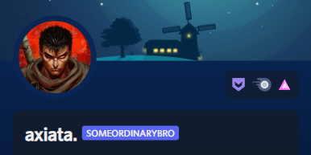

Welcome to Code Craft, your ultimate hub for embarking on your programming journey, whether you're a novice or a seasoned pro 📚. It's never too late to delve into the fundamentals and embrace the core concepts of coding. In this repository, you'll find a rich collection crafted by subject matter experts, spanning a variety of programming languages 🌐.

  <h3>For Beginners</h3>

If you're just beginning your programming journey or looking to refresh your foundational knowledge, we highly recommend starting with the 📂 "Before You Start" section. Inside, you'll discover valuable resources and guides to help you set up your coding environment and grasp the essential basics. Once you're comfortable, feel free to progress to the 📂 "CodeCrafting Corner" to start learning programming languages.

  <h3>For Experts</h3>

For seasoned developers eager to delve into specific languages, explore advanced concepts, or master the essentials of a new programming language, head directly to the 📂 "CodeCrafting Corner." There, you'll find comprehensive guides and resources covering various programming languages, frameworks, and tools, all meticulously curated by experts in the field.

  <h3>Guests</h3>

In our "Quick Reference 📂" section, you can access concise explanations of various topics, making it easy to grasp essential concepts quickly. Whether you're looking to refresh your memory or gain a quick understanding of specific subjects, this section is your go-to resource.

We firmly believe in the strength of community-driven learning 🌟. If you're interested in contributing, here's your path:

<table>
<tr>
  <td><strong>Step 1:</strong></td>
  <td><strong>Fork the Repository</strong></td>
</tr>
<tr>
  <td><strong>Step 2:</strong></td>
  <td><strong>Share Your Programming Insights</strong></td>
</tr>
<tr>
  <td><strong>Step 3:</strong></td>
  <td><strong>Create a New Branch</strong></td>
</tr>
<tr>
  <td><strong>Step 4:</strong></td>
  <td><strong>Submit a Pull Request</strong></td>
</tr>
<tr>
  <td><strong>Step 5:</strong></td>
  <td><strong>Connect with Us</strong></td>
</tr>
</table>

See [CONTRIBUTING.md](./CONTRIBUTING.md) for ways to get started.

Please adhere to this project's [code of conduct](./CODE_OF_CONDUCT.md).

#### For support, Contact us via our [Discord Server](https://discord.gg/WSHYZkEgTX).

#### To connect with us

- [@SomeOrdinaryBro](https://github.com/SomeOrdinaryBro) - [LinkedIn](https://www.linkedin.com/in/sajidsabreen/)

  

- [@mshajid](https://github.com/mshajid) - [LinkedIn](https://www.linkedin.com/in/shajidshafee/)

  

<!--  -->

## License

This repository is licensed under the [MIT License](LICENSE).

The MIT License is a permissive open-source license that allows you to use, modify, and distribute this repository for both commercial and non-commercial purposes. You are free to do so as long as you include the original license text and disclaimers. For more details, please read the [MIT License](LICENSE).

**TL;DR:** You can use, modify, and distribute this repository freely, but you must include the original license text.
